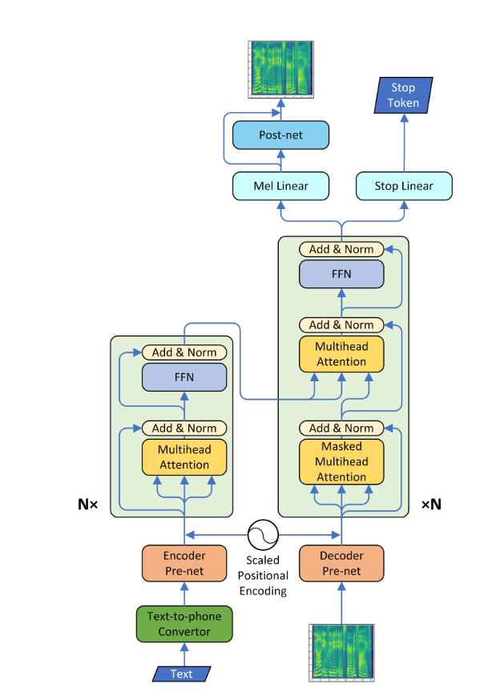
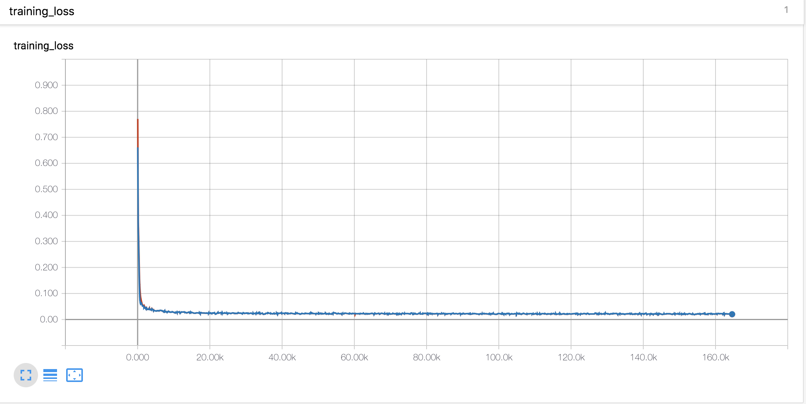
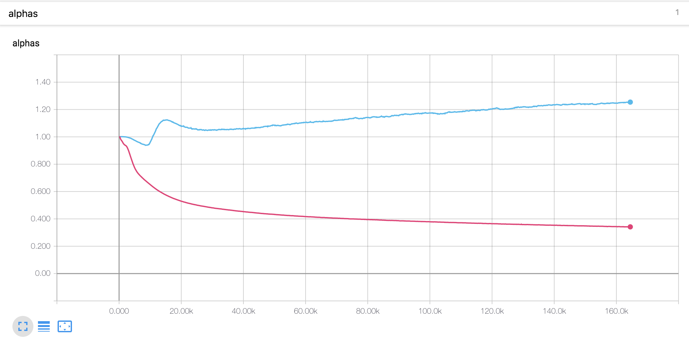
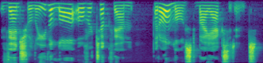

# Transformer-TTS
* A Pytorch Implementation of [Neural Speech Synthesis with Transformer Network](https://arxiv.org/abs/1809.08895)
* This model can be trained about 3 to 4 times faster than the well known seq2seq model like tacotron, and the quality of synthesized speech is almost the same. It was confirmed through experiment that it took about 0.5 second per step.
* I did not use the wavenet vocoder but learned the post network using CBHG model of tacotron and converted the spectrogram into raw wave using griffin-lim algorithm.



## Requirements
  * Install python 3
  * Install pytorch == 0.4.0
  * Install requirements:
    ```
   	pip install -r requirements.txt
   	```

## Data
* I used LJSpeech dataset which consists of pairs of text script and wav files. The complete dataset (13,100 pairs) can be downloaded [here](https://keithito.com/LJ-Speech-Dataset/). I referred https://github.com/keithito/tacotron and https://github.com/Kyubyong/dc_tts for the preprocessing code.

## Pretrained Model
* you can download pretrained model [here](https://drive.google.com/drive/folders/1r1tdgsdtipLossqD9ZfDmxSZb8nMO8Nf) (160K for AR model / 100K for Postnet)
* Locate the pretrained model at checkpoint/ directory.

## Attention plots
* A diagonal alignment appeared after about 15k steps. The attention plots below are at 160k steps. Plots represent the multihead attention of all layers. In this experiment, h=4 is used for three attention layers. Therefore, 12 attention plots were drawn for each of the encoder, decoder and encoder-decoder. With the exception of the decoder, only a few multiheads showed diagonal alignment.

### Self Attention encoder


### Self Attention decoder


### Attention encoder-decoder


## Learning curves & Alphas
* I used Noam style warmup and decay as same as [Tacotron](https://github.com/Kyubyong/tacotron)



* The alpha value for the scaled position encoding is different from the thesis. In the paper, the alpha value of the encoder is increased to 4, whereas in the present experiment, it slightly increased at the beginning and then decreased continuously. The decoder alpha has steadily decreased since the beginning.



## Experimental notes
1. **The learning rate is an important parameter for training.** With initial learning rate of 0.001 and exponentially decaying doesn't work.
2. **The gradient clipping is also an important parameter for training.** I clipped the gradient with norm value 1.
3. With the stop token loss, the model did not training.
4. **It was very important to concatenate the input and context vectors in the Attention mechanism.**

## Generated Samples
* You can check some generated samples below. All samples are step at 160k, so I think the model is not converged yet. This model seems to be lower performance in long sentences.

    * [sample1](https://soundcloud.com/ksrbpbmcxrzu/160k-0)
    * [sample2](https://soundcloud.com/ksrbpbmcxrzu/160k_sample_1)
    * [sample3](https://soundcloud.com/ksrbpbmcxrzu/160k_sample_2)

* The first plot is the predicted mel spectrogram, and the second is the ground truth.



## File description
  * `hyperparams.py` includes all hyper parameters that are needed.
  * `prepare_data.py` preprocess wav files to mel, linear spectrogram and save them for faster training time. Preprocessing codes for text is in text/ directory.
  * `preprocess.py` includes all preprocessing codes when you loads data.
  * `module.py` contains all methods, including attention, prenet, postnet and so on.
  * `network.py` contains networks including encoder, decoder and post-processing network.
  * `train_transformer.py` is for training autoregressive attention network. (text --> mel)
  * `train_postnet.py` is for training post network. (mel --> linear)
  * `synthesis.py` is for generating TTS sample.

## Training the network
  * STEP 1. Download and extract LJSpeech data at any directory you want.
  * STEP 2. Adjust hyperparameters in `hyperparams.py`, especially 'data_path' which is a directory that you extract files, and the others if necessary.
  * STEP 3. Run `prepare_data.py`.
  * STEP 4. Run `train_transformer.py`.
  * STEP 5. Run `train_postnet.py`.

## Generate TTS wav file
  * STEP 1. Run `synthesis.py`. Make sure the restore step. 

## Reference
  * Keith ito: https://github.com/keithito/tacotron
  * Kyubyong Park: https://github.com/Kyubyong/dc_tts
  * jadore801120: https://github.com/jadore801120/attention-is-all-you-need-pytorch/

## Comments
  * Any comments for the codes are always welcome.

